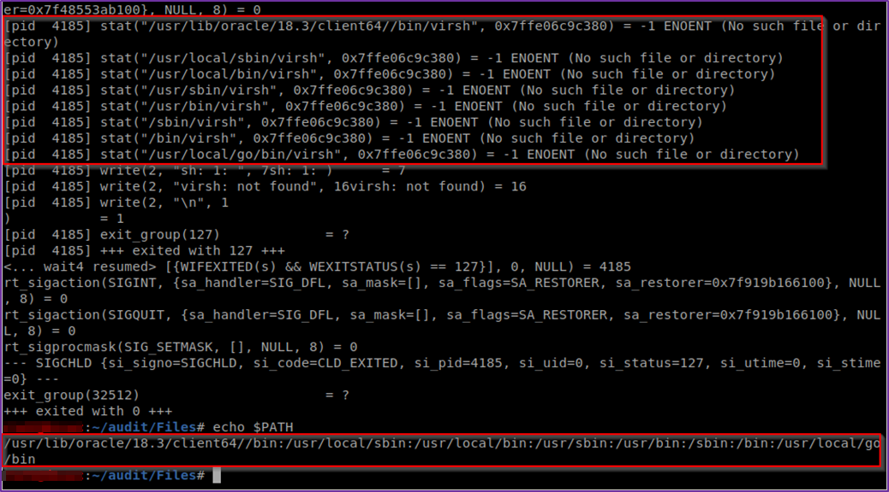
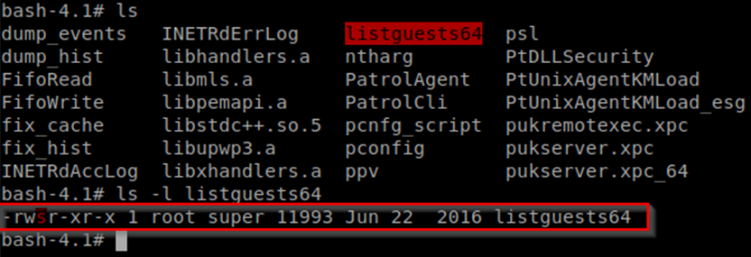
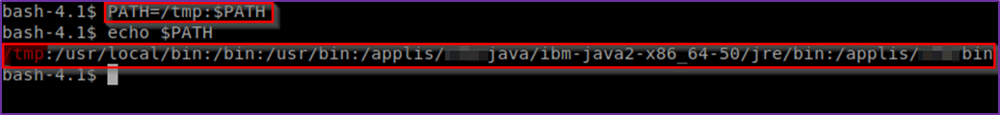
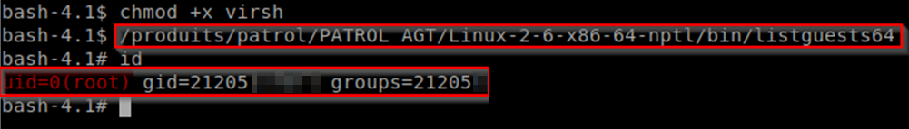

# [BMC Patrol] - ['listguests64' binary vulnerable to local privilege escalation attacks]

* **Exploit Title:** [BMC Patrol] - ['listguests64' binary vulnerable to local privilege escalation attacks]
* **Vendor Homepage**: https://www.bmc.com
* **Software Link**: https://docs.bmc.com/docs/PATROLAgent/107/downloading-the-installation-files-655597430.html
* **Version**: All BMC Patrol agent product versions prior to 9.13.10.02
* **Tested on**: BMC Patrol agent running on IBM Red Hat linux 6.8 (Santiago)
* **CVE** : CVE-2016-9638 

---

## Overview

All BMC Patrol agent product versions prior to 9.13.10.02 are affected by a vulnerability tracked with "CVE-2016-9638" (https://nvd.nist.gov/vuln/detail/CVE-2016-9638) that could lead to privilege escalation attacks and fully compromise the system. A specific binary used by BMC Patrol agent "listguests64" which is configured with the setuid bit looks for a missing binary named "virsh" using the PATH environment variable. Therefore, an local authenticated user can modify the PATH environment variable and create a malicious "virsh" binary to execute it with root privileges on the system.

## Prerequisites

* Local user account with limited privileges

## Full description

### Debugging the vulnerable binary by issuing the "strace –f ./listguests64" command

By analyzing the behaviour of the binary with "strace" utility, the "listguests64" binary looks for a missing binary named "virsh" using the PATH environment variable. Therefore, a user may modify the PATH environment variable and create a malicious "virsh" binary to execute it with root privileges on the system. As a reminder, PATH is an environment variable that holds values related to current user and operating system. It maintains a list of directories for searching executable programs. When the user runs an executable, the system will search for the program through PATH directories in order, from left to right.



### Exploitation

By default, the binary "listguests64" is configured with the setuid bit. This special access rights flag allows users to run programs using the security context of their owner, which represents a potential security risk if one of them is vulnerable using root privileges. Thus, by creating a malicious "virsh" executable on the temporary folder "/tmp" and modifying the current PATH environment variable, it is possible to obtain root privileges.

Checking if the "listguests64" has the setuid bit set:



Source code of the "virsh" program created on the target system:
```shell
#!/bin/bash
/bin/bash
```

Adding the "/tmp" folder path to the PATH environment variable:



Running the vulnerable binary to become superuser "root" on the target system:


